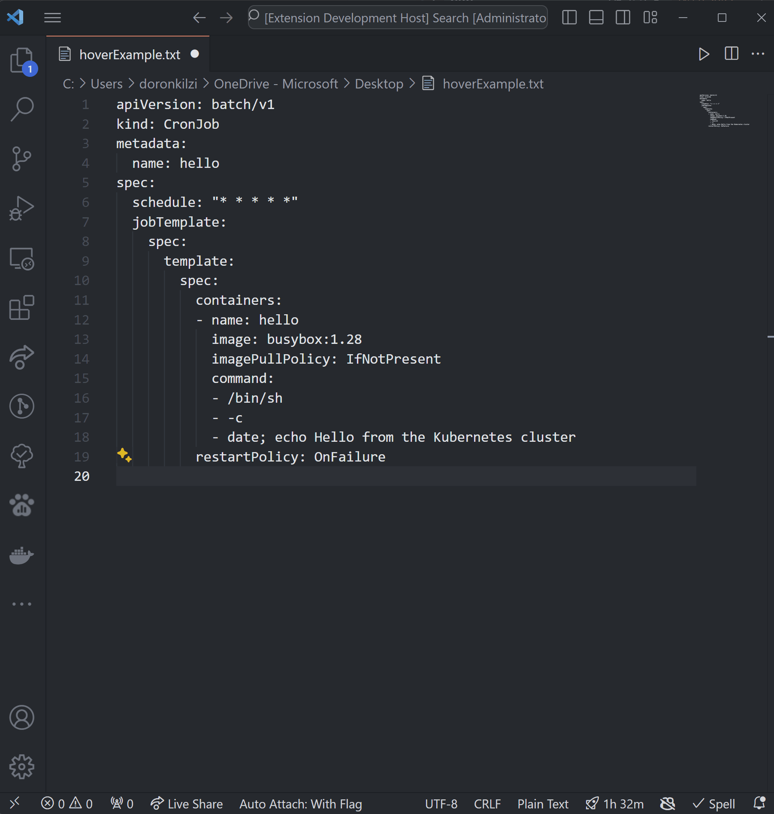
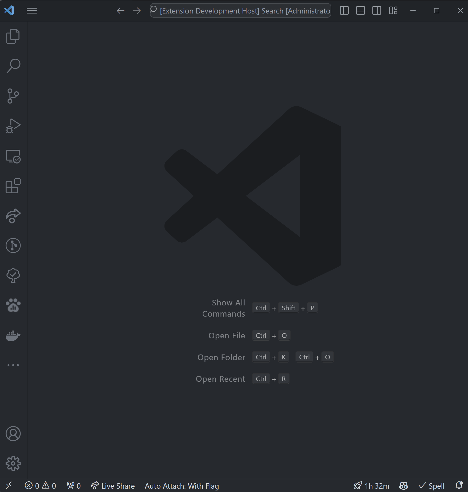

# cron-explainer README

Tired of looking at a cron and not understanding what it means? cron-explainer is here to help!

## Features

### Hover tooltip
hovering on cron will present a tooltip with human friendly explanation.

### Explain cron command
execute `Explain cron` command will let you enter a cron and then get an human friendly explanation.

### Validate cron command
execute `Validate cron` command will let you enter a cron, and validate if every part of the cron are valid.

## Known Issues

## Release Notes

### 1.0.0
first release of cron-explainer!

## Thanks to
1. [cronstrue]([linkurl](https://www.npmjs.com/package/cronstrue)) - the library that take a string of cron and convert it to human friendly explanation